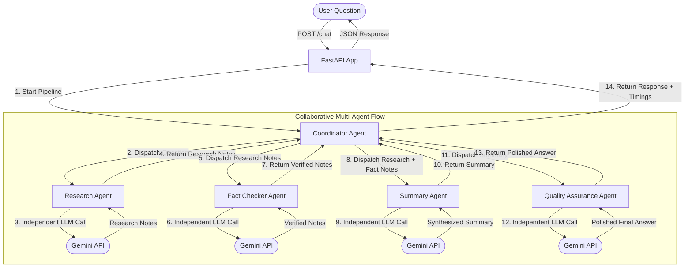
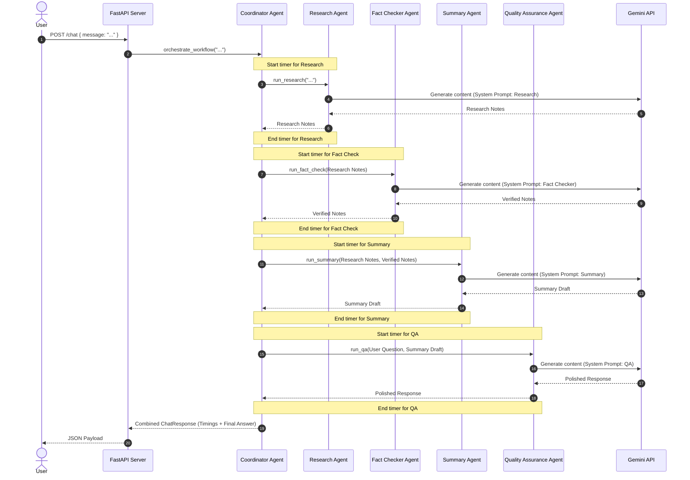

(Task ID:L3-01) Multi-Agent System
 multiple AI agents collaborate to answer a user's request. Built with **FastAPI** and **Google Gemini API** for the backend, and a clean, minimal **Vanilla HTML/CSS/JS** frontend.

---

## 1. Multi-Agent Architecture

The system consists of a single **Coordinator Agent** and three specialized sub-agents: **Research Agent**, **Fact Checker Agent**, and **Summary Agent**, culminating in a **Quality Assurance Agent**. Each agent is an independent worker making its own API calls with unique prompts, passing data sequentially.

### Architecture Diagram



---

## 2. Agent Responsibilities

| Agent Name | Input | Primary Responsibility | Output |
| :--- | :--- | :--- | :--- |
| **Coordinator** | User Question | Coordinates pipeline flow, combines inputs, measures execution time. | Orchestrated response with timings. |
| **Research Agent** | User Question | Breaks down the prompt, conducts conceptual analysis, and lists key points. | Detailed Research Notes. |
| **Fact Checker** | Research Notes | Audits research notes for inaccuracies, unsupported claims, or logical errors. | Verified Notes with corrections. |
| **Summary Agent** | Research + Verified Notes | Combines notes, resolves contradictions using fact checks, removes redundancies. | Synthesized Draft Summary. |
| **Quality Assurance** | Summary Draft | Evaluates draft completeness against user prompt, refines tone, and polishes style. | Polished Final Answer. |

---

## 3. Interaction & Sequence Diagram

The following sequence diagram details the runtime execution and memory passing of the system:



---

## 4. API Documentation

### Health Check Endpoint
* **URL**: `/health`
* **Method**: `GET`
* **Response**:
  ```json
  {
    "status": "healthy"
  }
  ```

### Chat Workflow Endpoint
* **URL**: `/chat`
* **Method**: `POST`
* **Request Headers**: `Content-Type: application/json`
* **Request Body**:
  ```json
  {
    "message": "Explain quantum computing in simple terms."
  }
  ```
* **Response Body**:
  ```json
  {
    "question": "Explain quantum computing in simple terms.",
    "research": "Detailed notes on Qubits, Superposition, and Entanglement...",
    "fact_check": "Verified corrections (e.g. quantum computing doesn't replace classical computers entirely)...",
    "summary": "Synthesized concise explanation...",
    "final_answer": "Final polished version ready for reading...",
    "steps": [
      { "agent": "Research Agent", "status": "Completed", "message": "Research notes generated successfully in 1.45s." },
      ...
    ],
    "execution_time": {
      "research": "1.45s",
      "fact_check": "1.23s",
      "summary": "1.10s",
      "quality_assurance": "1.65s",
      "total": "5.43s"
    }
  }
  ```

---

## 5. Installation and Running

### Prerequisites
* Python 3.11+
* Gemini API Key

### Setup Instructions

1. **Clone or copy the project files** to `D:\multi-agent-assistant` (or your destination folder).

2. **Navigate to the Backend directory**:
   ```bash
   cd D:\multi-agent-assistant\backend
   ```

3. **Create and activate a virtual environment**:
   ```bash
   python -m venv venv
   # On Windows (Command Prompt)
   venv\Scripts\activate
   # On Windows (PowerShell)
   .\venv\Scripts\Activate.ps1
   ```

4. **Install Dependencies**:
   ```bash
   pip install -r requirements.txt
   ```

5. **Configure Environment Variables**:
   Copy `.env.example` to `.env` and fill in your Gemini API Key:
   ```env
   GEMINI_API_KEY=your_gemini_api_key_here
   MODEL_NAME=gemini-1.5-flash
   ```

6. **Start the FastAPI Backend**:
   ```bash
   python -m uvicorn main:app --reload
   ```
   The backend will be running at `http://127.0.0.1:8000`.

7. **Launch the Frontend**:
   Simply open `frontend/index.html` in your web browser. You can do this by double-clicking the file or using a local development server (such as Live Server in VS Code).

---

## 6. Screenshot Placeholder

Once deployed and running, the interface looks as follows:

```text
+-------------------------------------------------------+
|  🤖 Multi-Agent AI Coordinator                        |
+--------------------------+----------------------------+
| Ask the System           | Agent Execution Pipeline   |
| [ Enter your question ]  |                            |
|                          | (o) Coordinator            |
| [ Execute Workflow ]     |  |                          |
|                          | (o) Research Agent (1.4s)   |
| Backend Status: Online   |  |                          |
|                          | (o) Fact Checker (1.2s)    |
|                          |  |                          |
|                          | (o) Summary Agent (1.1s)   |
|                          |  |                          |
|                          | (o) Quality Assurance (1.6)|
|                          |                            |
|                          +----------------------------+
|                          | Final Response             |
|                          | [ Polished answer text ]   |
+--------------------------+----------------------------+
```

---

## 7. Future Improvements (Conceptual Ideas)

Below are conceptual updates that could expand the capabilities of this system:
* **Parallel Execution**: Execute Research and independent checking tasks in parallel using Python's `asyncio` or `concurrent.futures`.
* **Supervisor Pattern (LangGraph)**: Move from sequential chains to agent networks routed by dynamic supervisorial decisions.
* **Tool Calling**: Equipping agents with Google Search, Python code interpreters, or custom calculator tools.
* **MCP Integration**: Registering agents as Model Context Protocol servers to share data across platforms.
* **Conversation Memory**: Adding stateful message history using databases for multi-turn sessions.
* **Persistent Storage**: Storing agent execution results in PostgreSQL or SQLite.
* **Streaming Responses**: Delivering agent updates chunk-by-chunk using Server-Sent Events (SSE).
